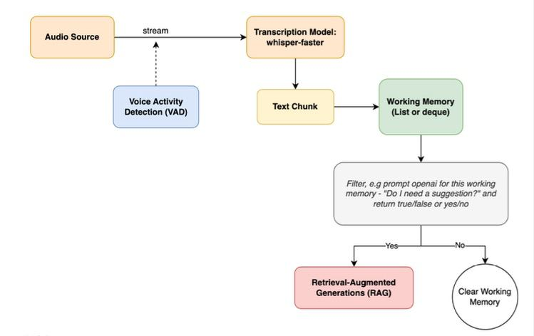
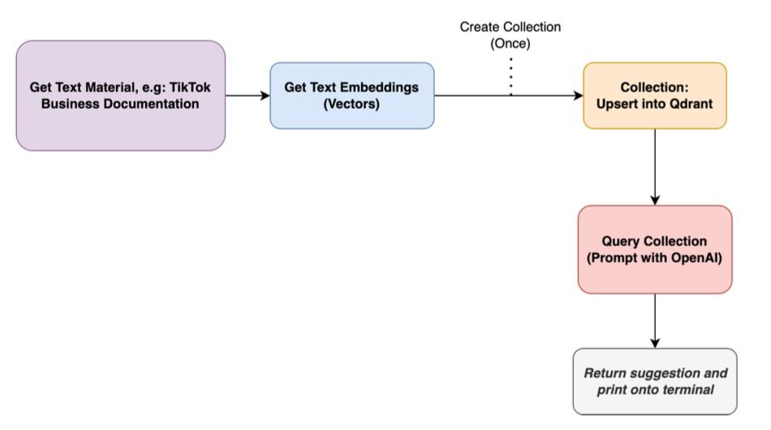

## Project Overview

This project is designed to assist sales teams by leveraging customer relationship management (CRM) systems to streamline their daily workflows throughout the end-to-end sales processes. By integrating artificial intelligence (AI) models, the project aims to provide smart sales helper functionalities that enable managerial insights and optimize sales strategies.

### Features and Functionality

- Smart Sales Helper: Using AI to provide actionable insights and recommendations for sales strategies.
- Sales Optimization: Helps in optimizing sales operations by analyzing data and predicting trends.

### Development Tools

- React: A JavaScript library for building user interfaces, particularly single-page applications where you can create reusable UI components.
- Tailwind CSS: A utility-first CSS framework for rapidly building custom user interfaces.
- [getstream.io](https://getstream.io)
- [socket.io](https://socket.io)
- [python-socketio](https://python-socketio.readthedocs.io/en/stable/)
- [OpenAI](https://openai.com/index/openai-api/)

### APIs

- React: Used to build the user interface components and manage the state of the application.
- Tailwind CSS: Used for styling the application efficiently with its utility-first approach.
- [getstream.io](https://getstream.io): Used to build the video calling application.
- [socket.io](https://socket.io): Provides APIs to create websocket clients and servers to enable two way communication betwen different modules in our codebase, for NodeJS.
- [python-socketio](https://python-socketio.readthedocs.io/en/stable/): For python.
- [OpenAI](https://openai.com/index/openai-api/)
- [Qdrant](https://qdrant.tech/)

### Assets

- No external assets were used in this project.

### Libraries Used

- React: For building the user interface.
- Tailwind CSS: For styling the application.
- Axios: For making HTTP requests to interact with the backend.
- [getstream.io](https://getstream.io)
- [socket.io](https://socket.io)
- [python-socketio](https://python-socketio.readthedocs.io/en/stable/)
- [OpenAI](https://openai.com/index/openai-api/)
- [WhisperLive](https://github.com/collabora/WhisperLive) : Implementation of faster-whisper.
- [BeautifulSoup4](https://tedboy.github.io/bs4_doc/)
- [Qdrant](https://qdrant.tech/)

### Problem Statement

Sales teams use customer relationship management (CRM) systems to help manage their daily tasks throughout the end-to-end sales processes. The challenge is to provide smart sales helper functionalities that leverage ML and AI models to enable managerial insights, optimize sales strategies, and streamline operations and management activities. This project aims to address this problem by integrating advanced analytical tools and intelligent recommendations into the CRM workflow.

###  Data Flow

1️⃣ Faster-Whisper: WhisperLive  
We utilized the WhisperLive library in order to implement the ASR component of our solution. 

2️⃣ Initial Filtering Process  
A filter was created using openAI to see if the transcriptions coming in were worth of query to the vector database. If transcripts passed the filter, then the transcriptions would be refined further into a more concise query, again using the openAI model.

3️⃣ Retrieval Augmentation Generation (RAG) 
- We web scraped a few raw html pages from the Tiktok Business Center using BeautifulSoup4 and then used OpenAI to restructure the page into text format.
- We vectorized each text using the openAI model and then loaded the embeddings into a vector database. We selected Qdrant to be our vector database for this project.
- Once the vectorized pages were loaded, we added the retrieval into our pipeline to fetch the nearest vector result, and used OpenAI to restructure the prompt based on the live transcriptions that were coming in through the ASR.
- To ensure queries were complete, we used openAI to complete or refine any incomplete or incoherent sentences to form a short query.
- Once a transcription passes the filtering process, the query is vectorized and then we fetch the nearest result. The result returned is then provided as context to OpenAI to then craft a relevant technical tip that could help the salesperson.

4️⃣ Saleshelper Bot Insight
The generation is then pushed to the front end to aid the client-facing user as an insight.

### Solution Architecture Diagram:

